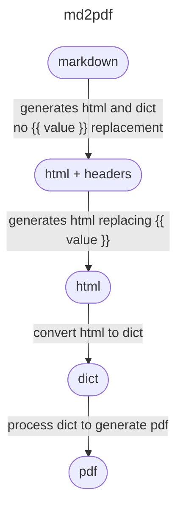

# markdown-to-pdf

## Install

Create `venv`:
```shell
python3.11 -m venv venv
source venv/bin/activate
```

Install package:
```shell
pip install --upgrade pip
pip install -r requirements.txt
pip install .
```

or from github:
```shell
pip install git+https://github.com/OnoArnaldo/markdown-to-pdf
```

in case the project is still private:
```shell
pip install git+ssh://git@github.com/OnoArnaldo/markdown-to-pdf
```


## Introduction

`md2pdf` process the markdown following the steps bellow.



> The configuration file should be set with
> the last html in mind.


## Usage

### Configuration

The configuration file is divided in 4 sections:

* Fonts: To add specific fonts to the document 
    (example: some font you downloaded from google fonts).
* Styles: Configure the styles than can be used in the document.
* Reports: Definition of the style to be used based on the 
    combination of attributes.
* Defaults: Default values to be used by the styles and reports.

> Check the file `tests/config.toml`.


#### Fonts:

Definition:
```toml
[[fonts]]
name = "Font Name"
regular = "path-to/Font-Regular.ttf"
bold = "path-to/Font-Bold.ttf"
italic = "path-to/Font-Italic.ttf"
bold_italic = "path-to/Font-BoldItalic.ttf"
```

Multiple fonts can be defined in the configuration. In case you don't have 
one of the styles, of the value from the style you have.

The path can be absolute or relative (the root will be set in the execution).


#### Styles:

Definition:
```toml
[[styles]]
name = "Style Name"
font_name = "Font Name"
font_size = 12
space_before = 5
space_after = 10
alignment = "TA_LEFT"
```

> Check appendix for all the options.

> The values in this section will overwrite the values in `defaults` section.

Multiple styles can be defined in the configuration. Note that, 
despite the naming style in reportlab uses mixedCase, the configuration will use 
lower_case_with_underscores format to be consistent with python
naming conventions.


#### Reports

Definition:
```toml
[[reports]]
style = "Style Name"

[[reports.attributes]]
name = "attr-name"
value = "attr-value"
```

Multiples reports ca be defined in the configuration, and multiple attributes
can be defined in each report.

* `Name` can be the attribute name or the value `tag`.
* `Value` can be the attribute value or the tag name.

examples:
```toml
[[reports.attributes]]
name = "tag"
value = "h2"

[[reports.attributes]]
name = "id"
value = "subtitle"
```

> The order of the reports in the configuration file matters!
> It will use the style of the first configuration it finds.


#### Defaults

Definition
```toml
[defaults.report]
style = "Style Name"

[defaults.style]
font_size = 10
alignment = "TA_JUSTIFY"
allow_widows = 0
space_before = 10
space_after = 10
```

> Check appendix for all style options.


### Template

The markdown file can start with key-value headers separated 
to the content by a blank line.

```markdown
name= "The Name"
company= "The Company"

# Hello {{ name }} {: #title}

## Hello company {{ company }} {: #subtitle}

Below is a list:

* item 1
* item 2
```


## Appendix

#### Paragraph Style

This is based on `reportlab.lib.styles.ParagraphStyle`.

> Note that the `mixedCase` was replaced by `lower_case_with_underscores`.

```toml
font_name = "Helvetica"
font_size = 10
leading = 12
left_indent = 0
right_indent = 0
first_line_indent = 0
alignment = "TA_LEFT"
space_before = 0
space_after = 0
bullet_font_name = "Helvetica"
bullet_font_size = 10
bullet_indent = 0
text_color =  "black"
#back_color = None
#word_wrap = None
border_width =  0
border_padding =  0
#border_color =  None
#border_radius =  None
allow_widows =  1
allow_orphans =  0
#text_transform = None
#end_dots = None
split_long_words = 1
underline_width =  ""
bullet_anchor =  "start"
justify_last_line =  0
justify_breaks =  0
space_shrinkage =  0.05
strike_width = ""              #stroke width
underline_offset = "-0.125*F"  #fraction of fontsize to offset underlines
underline_gap = 1              #gap for double/triple underline
strike_offset = "0.25*F"       #fraction of fontsize to offset strikethrough
strike_gap = 1                 #gap for double/triple strike
link_underline = 0
hyphenation_lang = ""
uri_waste_reduce = 0
embedded_hyphenation = 0
```
